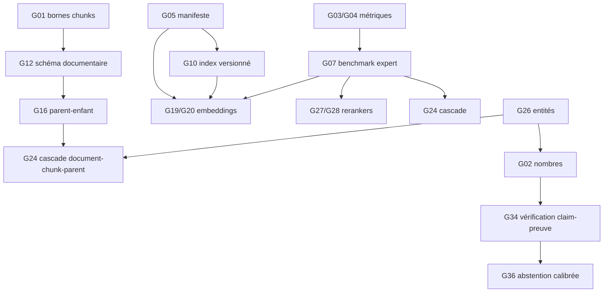

# Analyse des écarts du RAG CiderScholar

Date : 7 août 2026\
Références : `CURRENT_ARCHITECTURE.md`, `TARGET_ARCHITECTURE.md`.\
Important : l'audit n'a trouvé aucun benchmark corpus + experts permettant d'affirmer qu'un nouveau modèle ou une nouvelle cascade est supérieur à la baseline actuelle.

## 1. Échelle de priorité

- **P0 — invariant** : défaut déterministe de fidélité, traçabilité ou mesure ; corrigeable sans choisir un modèle « meilleur ».
- **P1 — preuve préalable** : capacité nécessaire pour évaluer/piloter les optimisations.
- **P2 — expérience** : hypothèse susceptible d'améliorer le RAG, soumise à benchmark.
- **P3 — optimisation** : coût/latence/ergonomie après qualité scientifique.

L'effort est une estimation locale : S < 2 jours, M 2–5 jours, L 1–3 semaines, XL > 3 semaines, hors annotation experte.

## 2. Matrice des écarts

| ID  | Priorité | Décision              | État actuel vérifié                                                                                                  | Cible / contrôle d'acceptation                                                                                               | Effort | Coûts dominants                              | Risque principal                                             |
| --- | -------- | --------------------- | -------------------------------------------------------------------------------------------------------------------- | ---------------------------------------------------------------------------------------------------------------------------- | -----: | -------------------------------------------- | ------------------------------------------------------------ |
| G01 | P0       | **MODIFY** T10        | Des chunks dépassent 750 tokens ; max observés 3 294 et 6 400.                                                       | L'algorithme ne produit jamais une unité > `max_tokens`, y compris texte ponctué/table-like ; tests propriété et régression. |      S | CPU négligeable ; réindexation future élevée | Changer les frontières et IDs si migration immédiate.        |
| G02 | P0       | **ADD** T38           | Validation numérique par présence de la chaîne du nombre seulement.                                                  | Valeur+signe+unité+intervalle+contexte appariés ; cas adversariaux et métrique dédiée.                                       |    M/L | CPU faible ; complexité élevée               | Faux refus sur notation scientifique.                        |
| G03 | P0       | **MODIFY** évaluation | CiderQA publie Recall@20/nDCG@20 seulement.                                                                          | Recall@10/@20/@50, MRR, nDCG multi-k dans un même rapport, compatibles avec anciens rapports.                                |    S/M | CPU bootstrap faible                         | Rupture des rapports/promotion existants.                    |
| G04 | P0       | **ADD** métrique      | Pas de fidélité numérique CiderQA explicite.                                                                         | Assessment claim-level, score avec intervalle, absent seulement pour claims non numériques ; tests positifs/négatifs.        |    S/M | Annotation experte                           | Auto-évaluation biaisée si non annotée indépendamment.       |
| G05 | P1       | **ADD** T43           | Manifeste Qdrant : modèle/dimension/distance, pas parser/chunker/tokenizer/hash.                                     | Refus de toute génération incompatible et rapport de signature complet.                                                      |      M | Stockage nul                                 | Blocage explicite d'un ancien index non migré.               |
| G06 | P1       | **MODIFY** benchmark  | Benchmark générique mono-`top_k`; CiderQA agrège la chaîne mais pas les coûts par étape.                             | Rapports séparés retrieval, rerank, génération, citations ; latence/RAM/API et fingerprint par configuration.                |      M | Temps de campagne                            | Mélanger des facteurs et attribuer un gain au mauvais étage. |
| G07 | P1       | **ADD** dataset       | CiderQA fournit le schéma, mais aucun résultat expert représentatif du corpus opérationnel n'est établi par l'audit. | Split train/dev/test scellé, familles équilibrées, jugements article/fragment/claim/citation/nombre/abstention.              |   L/XL | Temps expert dominant                        | Fuite du test ou annotations non cohérentes.                 |
| G08 | P1       | **MODIFY** T36        | Reprise de validation facettée à température 0,35.                                                                   | 0–0,1 pour tâches factuelles ; mesurer format/support avant suppression définitive.                                          |      S | API inchangé                                 | Taux de JSON valide plus faible.                             |
| G09 | P1       | **ADD** T44           | Hash/DOI à l'ingestion, mais aucun réconciliateur global new/modified/moved/missing.                                 | Dry-run, confirmation destructive, journal reprenable, cohérence SQLite-Qdrant.                                              |      L | I/O et stockage de rollback                  | Suppression ou remplacement erroné.                          |
| G10 | P1       | **ADD** T45           | Réindexation en place par article ; pas de génération parallèle/bascule.                                             | Collection versionnée, validation count/hash, bascule et rollback atomiques.                                                 |    M/L | Stockage temporaire ×2                       | Espace disque et divergence d'alias.                         |
| G11 | P1       | **ADD** T49           | Timings partiels ; pas de trace standard de tous les pools/versions.                                                 | Trace sans texte sensible, motifs de rejet et compteurs par étage.                                                           |      M | Stockage faible                              | Métadonnées sensibles dans les logs.                         |
| G12 | P2       | **ADD** T04           | Pages, sections canoniques et éléments ; paragraphes/sous-sections non persistés.                                    | Schéma documentaire versionné commun avec page/bbox/confiance/provenance.                                                    |      L | Stockage +5–20 %                             | Migration et doublons d'éléments.                            |
| G13 | P2       | **TEST** T06          | PyMuPDF heuristique uniquement.                                                                                      | Benchmark PyMuPDF vs GROBID vs voie sélective sur PDF stratifiés.                                                            |   L/XL | JVM, RAM, annotation                         | GROBID plus lourd sans gain de preuve.                       |
| G14 | P2       | **ADD** T07           | 57 actifs natifs privés acquis, zéro indexé.                                                                         | TEI/JATS parsés et alignés au PDF, locator explicite si page absente.                                                        |      L | Stockage/complexité                          | Versions divergentes et citations sans page.                 |
| G15 | P2       | **MODIFY** T08        | OCR Windows français par défaut, qualité heuristique, structure perdue.                                              | Routage de langue et niveau de preuve lié à la confiance OCR.                                                                |    M/L | CPU élevé pages scannées                     | Mauvaise langue, chiffres corrompus.                         |
| G16 | P2       | **ADD** T12           | Expansion par voisins de chunks, aucun parent persisté.                                                              | Enfant indexé → parent/sous-section borné → citation résolue aux enfants.                                                    |      L | Stockage +10–30 % ou relations               | Dilution du contexte.                                        |
| G17 | P2       | **ADD** T13           | Aucune protection dédiée valeur-unité/table/formule.                                                                 | Unités scientifiques atomiques et chunks tables avec en-têtes.                                                               |      L | Complexité                                   | Parseurs incomplets.                                         |
| G18 | P2       | **KEEP** T15          | E5-base local, 768, normalisé ; baseline non gelée par manifeste complet.                                            | Baseline reproductible et campagne gelée.                                                                                    |    S/M | Index actuel                                 | Impossible de reproduire une version de poids.               |
| G19 | P2       | **TEST** T16          | BGE-M3 déclaré, non comparé sur CiderQA local.                                                                       | Double index, mêmes chunks/cas, qualité + ressources.                                                                        |    M/L | CPU/RAM/stockage élevés                      | OOM/latence et confusion multi-facteurs.                     |
| G20 | P2       | **TEST** T17          | Jina v3 absent de la baseline.                                                                                       | Test local, licence/exécution auditées, paramètres de tâche versionnés.                                                      |    M/L | Modèle/index volumineux                      | Code distant/reproductibilité.                               |
| G21 | P2       | **TEST** T19          | Qdrant par défaut, sans calibration HNSW/quantification.                                                             | Courbe recall ANN vs exact, RAM/p95/disque.                                                                                  |      M | Plusieurs index                              | Perte de rappel silencieuse.                                 |
| G22 | P2       | **MODIFY** T21        | FTS sur section+texte ; entités/métadonnées scientifiques peu structurées.                                           | Champs titre/abstract/entités/table/DOI et requêtes exactes protégées.                                                       |      L | FTS +10–25 %                                 | Surpondération et faux positifs.                             |
| G23 | P2       | **TEST** T22          | Hybride FTS5 + dense déjà opérationnel.                                                                              | Sparse Qdrant ne remplace FTS5 que s'il gagne ou simplifie sans perte.                                                       |      L | Stockage/ingestion                           | Duplication inutile.                                         |
| G24 | P2       | **ADD** T23           | RRF chunk global puis agrégation article.                                                                            | Document → chunk avec canal global de garde → parent.                                                                        |   L/XL | CPU/index article                            | Faux négatif irrécupérable au document stage.                |
| G25 | P2       | **MODIFY** T24        | Pools dispersés dans config/profils ; candidats hybrid 200, articles 40/50, rerank 40.                               | Pools explicites et courbes 40/80/120, 100/200/400.                                                                          |      M | Latence/RAM                                  | Gain dû seulement au calcul.                                 |
| G26 | P2       | **ADD** T26           | Plan LLM + règles cidricoles, pas d'extracteur scientifique générique.                                               | DOI, nombres/unités, taxons, formules et conditions avec spans.                                                              |      L | CPU faible, annotation                       | Faux positifs/ambiguïtés.                                    |
| G27 | P2       | **KEEP** T27          | Reranker mMARCO installé et désactivé par défaut.                                                                    | Baseline « off » et « on » mesurée.                                                                                          |    S/M | CPU/RAM si activé                            | Scores non calibrés.                                         |
| G28 | P2       | **TEST** T28          | BGE reranker v2 m3 absent.                                                                                           | Comparaison off/current/BGE sur pools identiques.                                                                            |    M/L | CPU/RAM élevés                               | Latence portable.                                            |
| G29 | P2       | **MODIFY** T30        | Diversité article existante et quotas d'axes ; pas de détection de résultats publiés en double.                      | Pertinence directe prioritaire, diversité conditionnée et quasi-doublons.                                                    |    M/L | CPU faible                                   | Éviction du meilleur article.                                |
| G30 | P2       | **MODIFY** T31        | Round-robin, 10 articles max dans pack ; équilibré/deep tous deux 20 items.                                          | Budget par axe et saturation mesurée ; profils réellement séparés si utile.                                                  |      M | Tokens/API                                   | Contexte accru mais plus distrayant.                         |
| G31 | P2       | **ADD** T32           | Extraits tronqués à 2 400 caractères, sans compression structurale générale.                                         | Sélection de phrases + voisins en conservant négation/condition/unité.                                                       |      M | CPU faible                                   | Omission d'un qualificatif.                                  |
| G32 | P2       | **MODIFY** T34        | Un claim rapide → une preuve ; claims structurés mais parfois composites.                                            | Claims atomiques multi-preuves avec rôles explicites.                                                                        |    M/L | API/contrat                                  | Migration frontend et rapports.                              |
| G33 | P2       | **MODIFY** T35        | Map-reduce existe en pipeline séparé ; chatbot deep reste surtout facetté.                                           | Réutilisation conditionnelle pour réponses longues/multi-articles.                                                           |    M/L | Appels ARGO élevés                           | Quota, latence, propagation d'erreurs.                       |
| G34 | P2       | **ADD** T39           | Vérification sémantique deep seulement ; rapide = heuristiques.                                                      | Juge post-génération en équilibré/deep + déterministe partout.                                                               |      L | API/latence élevés                           | Juge corrélé et faux refus.                                  |
| G35 | P2       | **ADD** T40           | Marqueurs de contradiction au retrieval ; pas de registre de relations entre claims.                                 | Contradiction conditionnée par population/matrice/dose/temps.                                                                |      L | Complexité/API optionnel                     | Hétérogénéité présentée comme contradiction.                 |
| G36 | P2       | **MODIFY** T41        | Abstention présente, plusieurs motifs, calibration incomplète.                                                       | Readiness multi-critères calibrée sur dev ; motif actionnable.                                                               |      M | Faible                                       | Faux refus.                                                  |
| G37 | P3       | **ADD** T37           | Pas de cache réponse rapide ; cache signé dans deep research.                                                        | Cache par corpus+preuves+prompt+modèle+paramètres.                                                                           |      M | Stockage, invalidation                       | Réponse périmée.                                             |
| G38 | P3       | **MODIFY** T47        | Trois budgets réels mais plafonds finaux partiellement identiques.                                                   | Budgets/version/traces cohérents et coût/qualité publié.                                                                     |    S/M | Faible                                       | Configuration divergente.                                    |

## 3. Options explicitement rejetées

| ID  | Décision                                          | Motif scientifique/opérationnel                                                | Contrôle                                |
| --- | ------------------------------------------------- | ------------------------------------------------------------------------------ | --------------------------------------- |
| R01 | **REJECT** T09 — GROBID/OCR global                | Plus lourd, peut dégrader texte/page/nombres ; aucun benchmark ne le justifie. | Routage qualité, voie légère conservée. |
| R02 | **REJECT** T14 — réindexation complète immédiate  | Détruit comparabilité, IDs et rollback.                                        | Génération parallèle obligatoire.       |
| R03 | **REJECT** T18 — modèle dans collection existante | Risque de corruption sémantique/dimensionnelle.                                | Signature et collection distinctes.     |
| R04 | **REJECT** T29 — addition de scores bruts         | Logits CE et RRF ne partagent pas d'échelle.                                   | Rang ou calibration dev.                |
| R05 | **REJECT** T33 — contexte maximal systématique    | Dilution, coût et latence sans preuve de gain.                                 | Courbe support/token.                   |
| R06 | **REJECT** T42 — connaissance générale de secours | Réponse non traçable au corpus.                                                | Questions absentes → abstention.        |
| R07 | **REJECT** T46 — suppression implicite            | Destruction de données sans cible/confirmation.                                | Dry-run et confirmation.                |
| R08 | **REJECT** T50 — réglage sur test                 | Fuite et surestimation de performance.                                         | Test scellé, rapport signé.             |

## 4. Dépendances entre écarts

Le chemin critique n'est donc pas « installer un modèle plus grand ». Il est : mesurer correctement → versionner → comparer isolément → promouvoir.

## 5. Analyse des risques par couche

### 5.1 Ingestion

Risque dominant : une structure plus riche peut perdre l'ordre de lecture ou la page exacte. Le succès n'est pas « davantage de champs remplis », mais plus de preuves correctement localisées sans perte sur les PDF simples.

### 5.2 Chunking

Risque dominant : une nouvelle segmentation modifie tous les IDs et les distributions de scores. La correction de l'invariant maximal peut être livrée dans le code pour les futures ingestions, mais la migration des chunks existants doit attendre une génération parallèle.

### 5.3 Embeddings et reranking

Risque dominant : comparer des architectures avec des chunks/pools différents. Chaque campagne doit changer un facteur, garder le même corpus fingerprint et publier RAM, p95 et taille d'index.

### 5.4 Génération

Risque dominant : un meilleur style masque une baisse de support. L'évaluation doit se faire au claim atomique, pas par préférence globale de réponse.

### 5.5 Abstention

Risque dominant : augmenter artificiellement l'exactitude en refusant trop. Sensibilité, spécificité, faux refus et Brier doivent être lus ensemble, par famille de question.

## 6. Lots de réalisation

### Lot A — Mesure et invariants, sans migration de corpus

- **MODIFY** G01 : corriger la coupure des phrases longues et ajouter tests adversariaux.
- **MODIFY** G03 : exposer Recall@10/@20/@50 et nDCG multi-k.
- **ADD** G04 : porter une assessment/métrique de fidélité numérique.
- **ADD** G05 : concevoir le manifeste complet, sans invalider l'index actif avant migration.
- **MODIFY** G08 : mesurer puis stabiliser la température de reprise.

Acceptation : tests ciblés, compatibilité des rapports et quatre validations du dépôt.

### Lot B — Benchmark scientifique

- **ADD** G07 : annotations expertes et splits scellés.
- **MODIFY** G06/G11 : instrumentation par étage.
- geler E5/FTS/RRF/reranker-off comme baseline.

Acceptation : rapport reproductible, aucun réglage sur test.

### Lot C — Document et index parallèle

- schéma commun, TEI/JATS, parent-enfant ;
- manifeste et génération Qdrant parallèle ;
- dry-run de synchronisation.

Acceptation : zéro perte de page/texte, rollback démontré, pas de suppression implicite.

### Lot D — Expériences de retrieval

- BGE-M3, Jina v3 ;
- reranker courant/BGE ;
- pools ;
- cascade document → chunk → parent ;
- sparse Qdrant seulement comme ablation.

Acceptation : seuils scientifiques + ressources, revue experte aveugle.

### Lot E — Génération vérifiée

- claims atomiques multi-preuves ;
- nombres/unités ;
- vérification sémantique ;
- contradictions ;
- abstention calibrée ;
- map-reduce conditionnel.

Acceptation : gain ou non-infériorité de fidélité, pas seulement préférence stylistique.

## 7. Ce qui peut être corrigé immédiatement sans prétendre « optimiser » la qualité

Deux modifications sont justifiées par des invariants ou la capacité de mesure, indépendamment d'un benchmark de supériorité :

1. **G01** : une fonction configurée avec un maximum ne doit pas produire d'unité supérieure à ce maximum ;
2. **G03/G04** : le rapport demandé doit pouvoir mesurer Recall@10/@20/@50 et fidélité numérique.

Ces changements n'autorisent pas la réindexation destructive du corpus ni l'activation d'un nouveau modèle. Leur effet sur la qualité devra lui aussi être mesuré lors de la campagne.

## 8. Mise en œuvre réalisée après l'audit

La phase de code a commencé seulement après la création des quatre livrables d'analyse.

- **G01 — réalisé pour les futures ingestions** : `_split_long_sentence()` utilise désormais la même définition de token pour mesurer et couper ; l'overlap ne conserve plus une unité supérieure à son budget et il est abandonné s'il ferait dépasser le maximum avec l'unité suivante. Les données existantes n'ont pas été réingérées ou modifiées.
- **G03 — réalisé dans CiderQA** : un même rapport calcule Recall@10/@20/@50 et nDCG@10/@20/@50 aux niveaux notice, article et fragment, avec MRR historique conservé.
- **G04 — infrastructure réalisée** : chaque claim peut recevoir l'assessment `faithful`/`unfaithful`/`not_assessed`/`not_applicable`; le rapport publie fidélité numérique et couverture d'assessment avec intervalles bootstrap lorsque des claims numériques sont évalués. L'absence d'assessment n'est pas comptée comme succès.
- **G05 — réalisé pour les générations gérées** : un sidecar versionné, atomique et sans texte est écrit sous `qdrant/index-generation/<collection>.json`. Il fixe le contrat embedding/chunker/Qdrant, le hash du manifeste du modèle et les empreintes des chunks effectivement indexés, avec l’état `building`/`ready`. Une lecture d’index géré échoue fermée sur dérive, état intermédiaire ou fichiers de modèle modifiés ; les index historiques sans sidecar restent lisibles mais explicitement signalés `legacy_unverified`.
- **G05 — vérification et distribution** : `scripts.rebuild_index --verify-generation` compare hors chemin chaud les empreintes SQLite avec les IDs et payloads Qdrant. Les écritures gérées passent par `building → ready`, y compris indexation incrémentale, suppression, réindexation et fusion historique. Un package qui contient un sidecar valide avant activation son contrat, chaque ID et chaque payload de routage Qdrant contre SQLite ; les packages historiques sans sidecar restent acceptés. Le protocole d’exploitation est dans `docs/INDEX_GENERATION_MANIFEST.md`.
- **G02 — contrôle déterministe actif** : `app.numeric_verification` compare de façon conservatrice valeur, signe, comparateur, unité, intervalle/incertitude, direction et contexte, sans conversion implicite ni texte de preuve dans son rapport. Le RAG rapide l’applique à chaque statement et régénère ou refuse une quantité incompatible. Le mode deep persiste un checkpoint numérique sans extrait, versionne admissions/readiness et invalide le cache de réponse : une réponse ou reprise antérieure ne peut donc contourner le nouveau contrôle.
- **G08 — baseline de correction mesurable** : les reprises de validation abstract, mono-preuve et facettées utilisent une température dédiée bornée à `0–0,2`, avec `0,1` par défaut ; le forçage historique à `0,35` est supprimé. La valeur reste paramétrable pour une ablation CiderQA et n’est pas déclarée optimale sans résultat expert.
- **G11 — réalisé sur le chatbot rapide** : chaque phase de génération publie appels, reprises, température, tokens et issue. `retrieval_traces` compte variantes, lexical/dense, union RRF, pools d'axes, pré/post-reranking, sélection finale et motifs de retrait ; `timings` ajoute tokens et RAM observée aux bornes de chaque étape. Aucun de ces contrats ne porte requête, ID source, titre, DOI ou extrait. Les mêmes traces additives peuvent être signées dans chaque résultat CiderQA. G06 reste ouvert pour l'agrégation de campagne, les percentiles et la comparaison de configurations.
- **Compatibilité** : les champs sont additifs ; les rapports schema-v1 signés avant cette extension restent vérifiables via leurs champs réellement sérialisés.
- **Non réalisé volontairement** : aucune migration de chunks, aucun changement d'embedding/reranker, aucun réglage de pool, aucune activation GROBID/sparse/deep et aucune mutation du corpus opérationnel. Une génération de manifeste n’est créée qu’à la demande explicite (`--recreate`) ; l’index historique n’est pas réécrit ni adopté silencieusement.

Les validations de l'intervention sont réexécutées après chaque lot. Leur réussite démontre la
non-régression automatisée du dépôt, pas une amélioration de la qualité scientifique ; celle-ci
reste soumise à `RAG_BENCHMARK_PLAN.md`.
