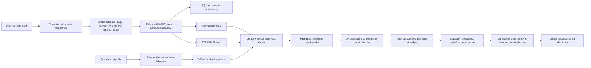

# Architecture cible du RAG scientifique CiderScholar

Date : 7 août 2026\
Ordre d'optimisation : fidélité factuelle → rappel utile → précision du classement → latence → simplicité.\
Statut : architecture proposée ; toute promotion qui dépend de la qualité doit franchir le benchmark décrit dans `RAG_BENCHMARK_PLAN.md`.

## 1. Légende de décision

- **KEEP** : conserver le mécanisme et protéger son invariant par des tests.
- **MODIFY** : faire évoluer un mécanisme existant, avec migration et non-régression.
- **ADD** : ajouter un mécanisme absent dont le bénéfice est un invariant de sûreté ou une capacité nécessaire.
- **TEST** : hypothèse concurrente, non activée par défaut avant benchmark corpus + experts.
- **REJECT** : option écartée pour le poste cible ou incompatible avec la traçabilité.

Chaque proposition reçoit un seul statut principal. Un statut `TEST` interdit d'écrire « meilleur » avant résultat statistiquement et scientifiquement interprétable.

## 2. Vue cible

## 3. Invariants cibles

### T01 — Autorité et provenance — KEEP

Conserver SQLite comme autorité du texte, des pages, des métadonnées et des preuves. Qdrant ne garde que vecteurs et identifiants. Toute affirmation scientifique publiée doit se résoudre ainsi :

`statement_id → evidence_id(s) → chunk/element_id → article_id → page(s) → hash documentaire`.

Coût : CPU nul ; RAM nulle ; stockage faible pour les relations ; API nul ; complexité faible.\
Risque de régression : faible, essentiellement migrations.\
Validation : tests d'intégrité référentielle, page exacte, suppression/réindexation et corruption Qdrant.

### T02 — Citations construites par l'application — KEEP

Le LLM choisit uniquement des IDs autorisés ; DOI, auteurs, année, page et lien proviennent de SQLite. Les extraits restent exacts et vérifiés comme sous-chaînes normalisées de leur source.

Coût : négligeable.\
Risque : métadonnée source incomplète, jamais fabrication compensatoire.\
Validation : précision/rappel citation, exactitude de page, DOI résolu vers l'article attendu.

### T03 — Garde-fous identiques dans tous les profils — KEEP

Conserver validation, provenance, abstention et refus des niveaux C/D quel que soit le budget. L'intensité change la couverture, pas la norme de preuve.

Coût : latence incompressible de validation ; API faible à moyenne selon profil.\
Risque : aucun compromis silencieux.\
Validation : matrice des mêmes cas adversariaux sur les trois profils.

## 4. Parsing scientifique

### T04 — Schéma documentaire commun — ADD

Ajouter un modèle interne versionné indépendant du parseur : document, section, sous-section, paragraphe, phrase, tableau/cellule, figure/légende, équation brute, référence bibliographique et coordonnées de page. Chaque nœud porte `source_hash`, `parser_name`, `parser_version`, page/bbox lorsque disponible et niveau de confiance.

Coût : CPU faible ; RAM faible ; stockage +5 à +20 % selon granularité ; API nul ; complexité moyenne.\
Risque : migration et duplication accidentelle des éléments existants.\
Validation : fixtures PDF natif, multi-colonnes, table, figure, formule, bibliographie et OCR ; conservation exacte des pages.

### T05 — PyMuPDF comme voie rapide et secours — MODIFY

Conserver PyMuPDF, mais adapter sa sortie au schéma commun et persister paragraphes/sous-sections. Corriger l'ordre multi-colonnes avec des heuristiques bornées documentées, sans prétendre reconstruire toute la lecture scientifique.

Coût : CPU/RAM faibles ; stockage faible ; API nul ; complexité moyenne.\
Risque : ordre de lecture modifié sur certains PDF simples.\
Validation : corpus de mise en page avec ordre de blocs expert, comparaison avant/après.

### T06 — Voie GROBID sélective — TEST

Évaluer GROBID, idéalement local, sur PDF natifs complexes et documents dont la structure PyMuPDF est faible. Ne pas remplacer aveuglément PyMuPDF. Comparer : titres/sections, auteurs/DOI, références, ordre de lecture, pages/bbox, tables et temps/mémoire. Une politique cible possible est : PyMuPDF par défaut, GROBID sur score de structure faible ou pour enrichir références/TEI.

Coût : CPU élevé ; RAM typiquement élevée pour un service JVM ; stockage modéré pour TEI ; API nul si local ; complexité élevée.\
Risque : pages/bbox ou tableaux moins fidèles, lourdeur opérationnelle, nouvelles erreurs de fusion.\
Validation : jeu expert de 50–100 PDF stratifiés ; exactitude structurelle et provenance, pas seulement taux d'extraction.

### T07 — Ingestion directe TEI/JATS — ADD

Parser les actifs natifs déjà téléchargés dans le schéma commun. Les formats natifs deviennent préférés pour la structure textuelle lorsque leur provenance et leur pagination sont exploitables ; le PDF reste la source de page et le fallback. La fusion doit conserver quel format justifie chaque locator.

Coût : CPU faible ; RAM faible ; stockage +5 à +15 % ; API nul ; complexité moyenne/élevée.\
Risque : perte de page sur XML, doublons PDF/XML, divergence de version éditeur.\
Validation : hash/version, alignement titre/DOI, déduplication des paragraphes et page exacte ou citation sans page explicitement marquée.

### T08 — OCR multilingue et qualité par page — MODIFY

Garder l'OCR comme fallback seulement. Ajouter détection/choix explicite de langue par document/page, conserver l'image et la confiance, et interdire qu'un extrait à faible confiance soit une preuve A sans confirmation par autre source.

Coût : CPU élevé sur pages scannées ; RAM moyenne ; stockage images optionnel élevé ; API nul ; complexité moyenne.\
Risque : mauvais choix de langue et inflation du temps d'ingestion.\
Validation : CER/WER par langue, rappel des nombres/unités, taux de faux caractères scientifiques.

### T09 — Remplacement global par OCR ou GROBID — REJECT

Ne pas appliquer un parseur lourd à tous les documents et ne pas OCRiser les pages déjà textuelles.

Motif : coût disproportionné sur un portable, risque de dégrader texte, nombres et pagination.\
Validation : aucune activation ; test de routage garantissant la voie légère lorsque la qualité est suffisante.

## 5. Chunking hiérarchique et scientifique

### T10 — Bornes du chunk enfant — MODIFY

Définir une cible opérationnelle de **400–700 tokens**, maximum dur autour de **900**, minimum souhaité **100–150**. Le minimum est une règle de fusion, jamais un motif de supprimer du texte. Le maximum doit être un invariant calculé avec le même tokenizer/estimateur que la coupure. Les tables, légendes et références ont des politiques dédiées.

Coût : CPU faible ; RAM faible ; stockage potentiellement ±15 % ; API nul ; complexité moyenne.\
Risque : changement massif des IDs et de la distribution des scores.\
Validation : histogrammes, zéro dépassement, zéro perte de caractères scientifiques, Recall@10/20/50 et page accuracy après réindexation isolée.

### T11 — Overlap structurel 10–15 % — MODIFY

Conserver un overlap cible de 10–15 %, mais le calculer sur unités atomiques et empêcher qu'un chunk d'overlap soit persisté sans contenu nouveau. Pour une coupure forcée, dupliquer la phrase frontière ou la paire valeur-unité nécessaire dans la limite maximale.

Coût : stockage dense +10–15 %, CPU d'indexation équivalent ; complexité moyenne.\
Risque : doublons dans le retrieval.\
Validation : taux de quasi-doublons, diversité top-k, conservation des phrases frontières.

### T12 — Parent-enfant persisté — ADD

Créer des enfants indexables et des parents non nécessairement vectorisés : paragraphe étendu, sous-section ou fenêtre structurale. Le hit enfant déclenche une expansion bornée vers son parent et ses voisins, avec le locator de chaque enfant conservé. Ne jamais citer le parent sans résolution vers les enfants exacts.

Coût : CPU faible après retrieval ; RAM faible/moyenne ; stockage +10–30 % si texte parent dupliqué, faible si relation seulement ; API réduit potentiellement par meilleur contexte ; complexité élevée.\
Risque : dilution du signal et dépassement du contexte.\
Validation : ablation enfant seul vs voisinage actuel vs parent ; support des claims, redondance et coût tokens.

### T13 — Unités scientifiques protégées — ADD

Détecter comme unités atomiques : valeur + unité, intervalle, incertitude, température, pH, durée, concentration, taxon/souche, formule chimique et renvoi figure/table. Une coupure ne doit pas séparer ces composants. Pour les tables, créer des chunks sémantiques par en-tête + ligne/colonne, reliés à la table et à sa légende.

Coût : CPU faible/moyen ; RAM faible ; stockage +5–20 % ; API nul ; complexité élevée.\
Risque : parseurs d'unités incomplets, faux groupements.\
Validation : fixtures adversariales multilingues et métrique de conservation valeur-unité.

### T14 — Réindexation immédiate de tout le corpus — REJECT

Ne pas remplacer en place les 238 145 chunks avant benchmark et migration réversible.

Motif : IDs, preuves persistées et comparabilité seraient perdus.\
Alternative : collection/version SQLite-Qdrant parallèle, échantillon pilote puis bascule atomique.

## 6. Embeddings et index dense

### T15 — E5-base 768 comme baseline — KEEP

Conserver `intfloat/multilingual-e5-base` et ses préfixes comme baseline reproductible. Enregistrer empreinte des fichiers du modèle, tokenizer, dimension, normalisation, longueur max et version de dépendance dans le manifeste d'index.

Coût : aucun coût additionnel significatif ; stockage manifeste négligeable.\
Risque : baseline actuelle imparfaite mais nécessaire à la comparaison.\
Validation : déterminisme, compatibilité collection et campagne baseline gelée.

### T16 — BGE-M3 — TEST

Évaluer BGE-M3 sur les mêmes chunks et questions, en dense seul puis, séparément, ses capacités sparse/multi-vector si le runtime local le permet. Ne pas confondre gain du modèle et gain de l'architecture hybride.

Coût : CPU et RAM supérieurs à E5-base ; stockage index potentiellement supérieur ; API nul ; complexité moyenne/élevée.\
Risque : latence et mémoire incompatibles avec le portable ; dimension/index différents.\
Validation : Recall@10/20/50, MRR, nDCG, catégories multilingues/entités/nombres, pics RAM et temps p95.

### T17 — Jina Embeddings v3 — TEST

Évaluer Jina v3 localement seulement si poids, licence et exécution hors-ligne sont compatibles. Tester les tâches/configurations d'embedding explicitement, sans chargement de code distant implicite.

Coût : CPU/RAM potentiellement élevés ; stockage élevé ; API nul en local ; complexité moyenne.\
Risque : dépendance `trust_remote_code`, longueur/latence et reproductibilité.\
Validation : même protocole que T16, plus audit d'exécution locale et manifeste du code modèle.

### T18 — Changement d'embedding sans double index — REJECT

Un changement de modèle exige une collection parallèle et une version de chunking explicite. Ne jamais réutiliser une collection avec dimension ou sémantique différente.

Coût évité : corruption silencieuse.\
Validation : le démarrage refuse modèle/dimension/tokenizer/hash incompatibles.

### T19 — Paramètres Qdrant calibrés — TEST

Pour chaque candidat dense retenu, tester HNSW, stockage mémoire/disque et éventuellement quantification sur le corpus complet. Le point de départ doit rester exact/non quantifié pour mesurer la perte de rappel.

Coût : plusieurs index, stockage ×2 à ×4 pendant campagne ; CPU d'indexation élevé ; RAM variable ; complexité moyenne.\
Risque : quantification ou HNSW trop agressif réduit le rappel utile.\
Validation : recall ann approximatif vs recherche exacte sur sous-ensemble, p95 et pic RAM.

## 7. Retrieval hybride et cascade

### T20 — FTS5/BM25 + dense + RRF — KEEP

Conserver le lexical local pour les termes rares, DOI, nombres et entités, le dense pour la paraphrase, et RRF pour éviter la calibration prématurée de scores hétérogènes.

Coût : CPU moyen, RAM faible, stockage déjà engagé, API nul, complexité faible.\
Risque : listes bruyantes si variantes trop nombreuses.\
Validation : ablations lexical, dense et fusion ; performance par famille de question.

### T21 — BM25 scientifique enrichi — MODIFY

Ajouter des champs FTS structurés : titre, abstract, section, sous-section, entités, table/légende et DOI normalisé. Protéger les expressions exactes, nombres-unités, formules et espèces. Conserver la requête originale dans chaque plan.

Coût : CPU faible/moyen ; stockage FTS +10–25 % ; API nul ; complexité moyenne.\
Risque : surpondération des métadonnées ou duplication.\
Validation : requêtes exactes/adversariales, Recall@k et faux positifs par champ.

### T22 — Sparse Qdrant — TEST

Comparer un sparse appris ou BM25 dans Qdrant à FTS5. Ne le promouvoir que s'il apporte un gain net reproductible ou une simplification sans perdre la recherche exacte.

Coût : stockage/ingestion supplémentaires, CPU moyen/élevé, complexité élevée.\
Risque : duplication de l'autorité lexicale, réglage opaque et maintenance.\
Validation : face-à-face avec FTS5 sur mêmes candidats et coût complet.

### T23 — Cascade document → chunk → parent — ADD

Étape 1 : présélection de documents par titre/abstract/métadonnées + meilleurs chunks, avec union de garde issue du lexical exact.\
Étape 2 : recherche dense/lexicale des chunks dans ces documents **et** un petit canal global pour éviter l'erreur de filtre.\
Étape 3 : RRF, reranking, diversification, puis expansion parent bornée.

La cascade doit conserver un quota global hors présélection, sinon un faux négatif document devient irrécupérable.

Coût : CPU moyen ; RAM faible/moyenne ; stockage d'un index article additionnel faible ; API nul ; complexité élevée.\
Risque : chute de rappel à l'étape document.\
Validation : recall oracle par étape, taux de documents pertinents perdus et ablation du canal global.

### T24 — Pools candidats mesurés — MODIFY

Exposer et versionner séparément : documents candidats, chunks lexical/dense, union RRF, pool cross-encoder, articles finaux et passages packés. Valeurs initiales de benchmark : document 100/200 ; dense 100/200 ; lexical 100/200 ; union 200/400 ; reranker 40/80/120 ; sortie 10/20/50.

Coût : CPU/latence proportionnels ; RAM moyenne au plus grand pool ; API nul ; complexité faible.\
Risque : faux gain de qualité dû uniquement à plus de calcul.\
Validation : courbes qualité/coût, pas une valeur unique.

### T25 — Expansion multilingue additive — MODIFY

Conserver l'originale avec le poids le plus fort. Ajouter variantes FR/EN et synonymes scientifiques ; dédupliquer ; plafonner par profil. Une entité exacte, un DOI, une formule et une valeur-unité ne sont jamais traduits ou supprimés.

Coût : multiplication des recherches ; RAM faible ; API d'un plan LLM déjà existant ; complexité moyenne.\
Risque : dérive sémantique et bruit.\
Validation : fidélité des entités, rappel cross-lingue et ablation avec/sans expansion.

### T26 — Extraction d'entités hybride — ADD

Ajouter un extracteur déterministe de DOI, nombres/unités, pH, temps, températures, formules courantes et taxons ; compléter par le plan GPT-OSS pour les concepts non structurés. Persist(er) les entités de documents avec leur span et leur confiance.

Coût : CPU faible ; stockage faible ; API inchangé ; complexité moyenne/élevée.\
Risque : couverture incomplète et ambiguïtés.\
Validation : précision/rappel d'entités sur annotations expertes et tests multilingues.

## 8. Reranking, agrégation et diversité

### T27 — Reranker actuel comme baseline — KEEP

Conserver `mmarco-mMiniLMv2-L12-H384-v1` dans la matrice de benchmark, sans l'activer par défaut avant mesure de son bénéfice et de sa mémoire.

Coût actuel si désactivé : nul ; activé : CPU moyen/élevé, RAM moyenne.\
Risque : échelle de score non calibrée.\
Validation : nDCG/MRR après RRF et p95.

### T28 — BGE reranker v2 m3 — TEST

Comparer `bge-reranker-v2-m3` au reranker courant et à l'absence de reranker sur pools 40/80/120. Le reranker juge question + passage enfant avec contexte de titre/section, pas un document concaténé arbitrairement.

Coût : CPU/RAM élevés sur portable, stockage modèle additionnel, API nul, complexité moyenne.\
Risque : temps de réponse incompatible ou bénéfice limité après bon RRF.\
Validation : gain conditionnel par famille et budget, intervalles bootstrap.

### T29 — Fusion du score reranker non calibré avec le score RRF — REJECT

Ne pas additionner directement logits cross-encoder et scores structurés sans calibration. Utiliser d'abord le rang du reranker ou une calibration apprise uniquement sur train/dev, jamais test.

Motif : échelles incompatibles et fuite d'évaluation.\
Validation : test d'invariance d'échelle et calibration hors test.

### T30 — Diversification scientifique contrainte — MODIFY

Diversifier après pertinence : axe de recherche, article, année/revue et matrice expérimentale. Réserver d'abord les preuves directes, puis la diversité. Détecter quasi-doublons et publications multiples d'un même résultat lorsque possible.

Coût : CPU faible ; RAM faible ; API nul ; complexité moyenne.\
Risque : diversité qui évince le meilleur résultat.\
Validation : couverture d'axes, nDCG et exactitude/completude de synthèse.

## 9. Construction du contexte

### T31 — Pack déterministe par sous-question — MODIFY

Allouer le budget par axe : preuve directe minimale, preuves de convergence, contradiction, méthode si demandée, puis support. Round-robin par article, déduplication inter-articles et conservation des locators. Les plafonds équilibré/deep en nombre d'items doivent être distincts ou justifiés par une courbe de saturation.

Coût : CPU faible ; RAM faible ; API potentiellement réduit ; complexité moyenne.\
Risque : quotas trop rigides.\
Validation : couverture des axes et support des claims par token de contexte.

### T32 — Compression extractive avant résumé — ADD

Couper seulement aux limites structurales et garder les phrases qui contiennent l'entité/relation/nombre recherché, avec voisinage. Un résumé LLM ne remplace jamais l'extrait citable ; il peut seulement aider au routage.

Coût : CPU faible ; API nul pour extractif ; complexité moyenne.\
Risque : suppression d'un qualificatif.\
Validation : entailment et conservation négation/condition/unité.

### T33 — Contexte géant non filtré — REJECT

Ne pas augmenter la qualité supposée en envoyant toujours le maximum 64 k caractères. Le contexte doit être mesuré sur support par token et taux de distraction.

Motif : coût, latence et dilution de la preuve.\
Validation : courbe qualité/taille de contexte.

## 10. Génération et synthèse

### T34 — Contrat JSON à affirmations atomiques — MODIFY

Étendre le contrat pour permettre à une affirmation atomique de référencer une ou plusieurs preuves, avec rôle `support`, `contrast`, `method`, type `fact`, `interpretation`, `recommendation`, et portée/conditions. Une affirmation complexe doit être divisée, pas munie d'une citation globale.

Coût : API légèrement supérieur ; stockage faible ; complexité moyenne.\
Risque : réponses plus fragmentées.\
Validation : atomicité experte, précision/rappel citation et entailment par paire claim-preuve.

### T35 — Map-reduce par article et par axe — MODIFY

Réutiliser `ArticleEvidenceExtractor` et `HierarchicalSynthesisService` pour les réponses longues : map par article/axe, reduce de convergences/contradictions, puis rendu. Le chatbot court garde un seul appel lorsque la question est mono-axe et le contexte petit.

Coût : API élevé en équilibré/deep ; CPU local faible ; complexité moyenne car composants existants.\
Risque : accumulation d'erreurs et quota ARGO.\
Validation : fidélité/completude/coût face au chemin monolithique.

### T36 — Température scientifique stable — MODIFY

Garder 0 ou 0,1 pour extraction, validation et synthèse factuelle. Supprimer la reprise automatique à 0,35 sauf preuve expérimentale spécifique ; une reprise corrige le prompt/format ou réduit la tâche.

Coût : nul ; API inchangé ; complexité faible.\
Risque : moins de variété stylistique, sans enjeu scientifique.\
Validation : taux de JSON valide, support des claims et variance entre runs.

### T37 — Cache de sorties scientifiques par signature — ADD

Pour les étapes déterministes/reprises, signer question normalisée, IDs+hash de preuves, prompt/version, modèle et paramètres. Ne pas cacher une réponse si le corpus, le contrat ou la preuve change. Chiffrer/protéger comme les données locales.

Coût : stockage faible/moyen ; CPU faible ; API réduit ; complexité moyenne.\
Risque : résultat périmé ou mélange de corpus.\
Validation : invalidation sur chaque composant de signature et absence de texte dans checkpoints qui doivent rester text-free.

## 11. Vérification scientifique et abstention

### T38 — Vérificateur déterministe des nombres — ADD

Extraire dans claim et preuve : valeur, signe, intervalle, unité, échelle, incertitude, comparateur et contexte immédiat. Exiger une correspondance canonique ou une conversion explicitement autorisée. Rejeter les nombres orphelins et distinguer `15 °C`, `15 %`, `pH 3,5`, `−15` et `[10, 20]`.

Coût : CPU faible ; API nul ; complexité élevée mais bornée.\
Risque : faux refus sur formats exotiques.\
Validation : jeu adversarial et métrique de fidélité numérique au niveau claim.

### T39 — Vérification claim-preuve post-génération — ADD

Combiner contrôles déterministes et, pour équilibré/deep, vérification sémantique à température 0 sur chaque claim atomique. Vérifier implication, négation, population, intervention, comparateur, condition, temporalité et modalité. L'échec retire le claim ou déclenche une régénération bornée, jamais une citation alternative inventée.

Coût : API moyen/élevé ; latence élevée ; complexité élevée.\
Risque : erreurs du juge LLM et faux refus corrélés au générateur.\
Validation : annotation experte indépendante, juge aveugle, taux de support et faux support.

### T40 — Registre des contradictions — ADD

Créer des relations entre claims normalisés : compatible, contradiction apparente, contradiction sous conditions différentes, non comparable. Conserver matrices/populations/doses/durées pour ne pas présenter une hétérogénéité comme contradiction.

Coût : CPU faible + API optionnel moyen ; stockage faible ; complexité élevée.\
Risque : normalisation excessive.\
Validation : cas CiderQA contradiction et revue experte des conditions.

### T41 — Abstention calibrée — MODIFY

Calculer une readiness transparente à partir de : présence de preuve directe, couverture des axes obligatoires, claims admissibles, contradictions non résolues et qualité OCR/page. Ne pas utiliser le score dense brut comme probabilité. Produire un motif actionnable et les informations manquantes.

Coût : faible ; API nul ou faible ; complexité moyenne.\
Risque : faux refus.\
Validation : sensibilité, spécificité, faux refus, Brier et courbe par seuil sur dev uniquement.

### T42 — Réponse sans preuve pour satisfaire la question — REJECT

Aucun fallback de connaissance générale pour combler une lacune documentaire dans une réponse présentée comme issue du corpus.

Motif : incompatible avec l'objectif de fidélité.\
Validation : questions pièges absentes du corpus.

## 12. Synchronisation incrémentale et versions

### T43 — Manifeste d'index complet — ADD

Pour chaque génération d'index : `corpus_id`, schéma DB, parser/version, chunker/version+paramètres, modèle/hash/tokenizer/dimension, normalisation, Qdrant config, date et code revision. L'index est refusé si la signature ne correspond pas au runtime.

Coût : négligeable ; complexité faible.\
Risque : blocages explicites après mise à jour, souhaitables.\
Validation : matrice d'incompatibilités.

### T44 — Réconciliateur par chemin et hash — ADD

Scanner sans mutation, classifier `new`, `unchanged`, `modified`, `moved`, `missing`, `duplicate_hash`, `duplicate_doi`, puis demander confirmation pour les suppressions/remplacements. Appliquer SQLite+Qdrant par lot reprenable ; conserver journal et ancien index jusqu'au commit.

Coût : hash I/O moyen ; RAM faible ; stockage temporaire jusqu'à ×2 en migration ; API nul ; complexité élevée.\
Risque : suppression erronée ; confirmation et dry-run obligatoires.\
Validation : crash à chaque phase, move/modify/delete, rollback et zéro orphelin.

### T45 — Collections versionnées et bascule atomique — ADD

Construire `science_chunks_<generation>` en parallèle, vérifier count/hash/sampling, puis changer un alias ou une référence applicative. Garder une génération précédente jusqu'à acceptation.

Coût : stockage temporaire ×2 ; CPU d'indexation élevé ; complexité moyenne.\
Risque : espace disque.\
Validation : reprise, bascule, rollback et cohérence SQLite-Qdrant.

### T46 — Mise à jour destructive implicite — REJECT

Ne jamais supprimer ou remplacer un article parce qu'un scan ne retrouve plus un chemin sans cible explicite, aperçu et confirmation applicative.

## 13. Profils cibles

Les chiffres sont des points de départ de benchmark, pas des valeurs promues.

| Dimension                    |             Rapide |          Équilibré |          Approfondi |
| ---------------------------- | -----------------: | -----------------: | ------------------: |
| Variantes max                |                3–4 |                6–8 |                8–12 |
| Documents candidats          |                 50 |                100 |                 200 |
| Union chunks avant rerank    |                100 |                200 |                 400 |
| Pool reranker                |            0 ou 40 |                 80 |                 120 |
| Articles finaux              |                5–6 |               8–10 |               12–20 |
| Passages enfants/article     |                2–3 |                4–5 |                 6–8 |
| Expansion parent             |             petite |            moyenne |   large mais bornée |
| Itérations retrieval         |                  1 |         1 + lacune |           2 maximum |
| Génération                   |         mono-appel | mono ou map-reduce |          map-reduce |
| Vérification LLM claim       | option benchmarkée |                oui | oui + contradiction |
| Nombres/citations/abstention |           toujours |           toujours |            toujours |

### T47 — Profils comme budgets versionnés — MODIFY

Chaque profil doit versionner tous les pools, longueurs, appels et timeouts. Le rapport de réponse expose les étapes et le statut des validations, sans révéler les prompts internes.

Coût : faible ; complexité faible.\
Risque : dérive de configuration.\
Validation : snapshots de budget et comptage réel des appels/tokens.

### T48 — Activation de deep research après promotion — KEEP

Conserver le verrou par rapport CiderQA signé, mémoire et modèles. Étendre les critères avec fidélité numérique et Recall@10/@50 avant activation.

Coût : campagne d'évaluation ; bénéfice : pas de fonctionnalité scientifique non validée activée.\
Risque : activation plus lente.\
Validation : signature, split scellé, seuils et absence de fuite test.

## 14. Observabilité scientifique

### T49 — Traces de pipeline sans contenu sensible — ADD

Journaliser IDs/hash, tailles de pools, rangs, statuts, versions, durées, mémoire, motifs de rejet/abstention et compteurs API. Le texte complet, les clés, les PDF et prompts avec contenu privé restent exclus.

Coût : stockage faible ; CPU faible ; complexité moyenne.\
Risque : fuite par métadonnées ; revue de schéma obligatoire.\
Validation : tests de secrets et inspection des logs.

### T50 — Optimisation automatique sur le split test — REJECT

Les seuils, poids, prompts et pools se règlent sur train/dev. Le test scellé n'est ouvert que pour une décision de promotion, avec rapport signé.

## 15. Ordre de réalisation recommandé

1. Protéger les invariants : maximum de chunk, manifeste, métriques multi-k et numériques.
2. Construire un benchmark expert représentatif et geler la baseline actuelle.
3. Ajouter le schéma documentaire et l'ingestion TEI/JATS sans basculer l'index principal.
4. Prototyper le chunking hiérarchique dans une génération parallèle.
5. Comparer E5/BGE/Jina et les rerankers, un facteur à la fois.
6. Ajouter la cascade document → chunk → parent et calibrer les pools.
7. Étendre le contrat atomique, le vérificateur numérique et les contradictions.
8. Promouvoir uniquement les combinaisons qui passent les seuils qualité, ressources et experts.

Cette séquence évite de modifier simultanément parser, chunks, embeddings et reranker, ce qui rendrait toute causalité impossible à établir.
