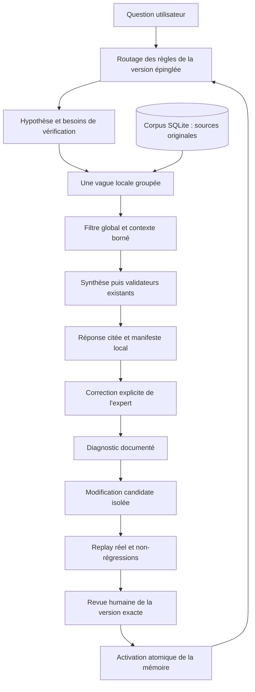

# Mémoire experte CiderScholar — roadmap d’implémentation

Date : 7 septembre 2026. Révision examinée : `676684a`, arbre de travail initial propre.
Statut : **architecture cible et plan d'implémentation**. Le socle hors ligne a commencé ; consulter
[la progression vérifiée](EXPERT_MEMORY_PROGRESS.md) pour distinguer fonctionnalités présentes,
lots partiels et étapes restantes. Les décisions utilisateur déjà acceptées restent prioritaires.

## 1. Résultat recherché

Faire en sorte qu’une correction experte puisse améliorer durablement CiderScholar : conserver le
problème, identifier son origine, proposer une modification limitée, vérifier ses effets sur des
questions indépendantes, puis activer une version explicitement revue et réversible.

L’[article de Meta du 2 septembre 2026](https://engineering.fb.com/2026/09/02/ml-applications/organizational-second-brain-ai-learns-from-experts/)
présente une séparation entre connaissances structurées et procédures d’analyse, associée à une
boucle de correction experte : diagnostic, modifications candidates, évaluation et revue humaine.
Le système décrit conserve des dépendances explicites et enrichit ses tests après correction, sans
réentraîner le modèle. Cette publication fournit une inspiration d’architecture, pas une preuve de
performance pour notre application.

**Adaptation proposée ici : une mémoire de méthode et de vocabulaire au-dessus du RAG existant.**
Les faits scientifiques restent dans les passages et abstracts originaux de SQLite. Une règle experte
guide la recherche et l’interprétation ; elle n’autorise jamais une affirmation non documentée.

Livrables de cette roadmap :

- ce fichier : ordre des travaux, points d’insertion et sorties attendues ;
- [contrats techniques](EXPERT_MEMORY_CONTRACTS.md) : données, frontières, routes et commandes ;
- [validation et reprise](EXPERT_MEMORY_VALIDATION.md) : tests, gates, incidents et consigne d’agent.

Les chemins et symboles indiqués dans l'état initial ont été lus dans le dépôt. Les lots ci-dessous
conservent leurs instructions de construction ; le document de progression fait autorité sur leur
avancement. Les trois commandes déjà disponibles sont décrites dans [knowledge/README.md](../knowledge/README.md).

## 2. Critères d’acceptation issus de la demande et du projet

1. L’agent exécutant doit pouvoir choisir le prochain lot sans réinventer l’architecture : dépendance,
   fichiers, séquence, tests et condition de sortie sont fournis.
2. Appliquer `HOW_TO_WORK_ON_CIDERSCHOLAR.md`, particulièrement §5.1 et les précisions de septembre :
   hypothèse réservée au retrieval, besoins atomiques, vague groupée unique, contexte intra-article
   borné, filtre global A–D, synthèse unique et validateurs existants.
3. Ne réintroduire ni axes de recherche successifs, ni contrôleur de couverture, ni acquisition
   implicite pour corriger une réponse. L’unique requête maximale de génération, initiale comprise,
   restent une borne ; les repasses utilisent les mêmes preuves.
4. Une preuve contradictoire directement pertinente reste admissible. La mémoire ne force ni
   confirmation d’hypothèse, ni niveau A/B, ni suppression des preuves pertinentes présentées.
5. Les corpus et conversations sont locaux. Les corrections ne sont pas partagées automatiquement.
   Les jobs, annulations, quotas, leases, ressources paresseuses et contrats frontend sont conservés.
6. Aucun entraînement de modèle, changement de moteur vectoriel ou réindexation générale n’est
   nécessaire au premier périmètre.
7. Distinguer dans chaque livraison : tests techniques réussis, évaluation scientifique réelle,
   validation experte et activation. Aucun de ces états n’implique automatiquement le suivant.

Ce plan ne transforme pas ses propositions en nouvelles consignes utilisateur acceptées. Au lot 00,
documenter leur statut ; une décision de méthode effectivement validée sera ensuite consignée dans
le guide avec sa date et sa provenance.

## 3. Ce qui existe réellement

| Élément | Point d’appui vérifié | Conséquence pour l’implémentation |
|---|---|---|
| Orchestration chatbot | `app/services/workflows.py::answer_chatbot` et `_answer_chatbot` | Ajouter des services dédiés ; ne pas dupliquer ce pipeline volumineux. |
| Ancien chemin par axes | Retiré du code le 10 septembre 2026 après vérification de l'absence d'appel ; conservé dans l'historique Git | Les structures de migration et les services d'évaluation encore utilisés restent disponibles. |
| Préparation hypothétique | `app/retrieval/hypothesis_planning.py::ArgoHypothesisPlanningService` | Point d’insertion des synonymes et contraintes de recherche. |
| Intention et vocabulaire | `app/retrieval/scientific_intent.py::analyze_scientific_intent` | Extraire progressivement les données lexicales ; conserver les algorithmes Python. |
| Filtre global | `app/retrieval/global_semantic_filter.py` | Tracer décisions par candidat et adapter les instructions sans affaiblir les contrôles. |
| Synthèse conversationnelle | `app/updates/pilot_rag.py::CiderEvidenceRagService.answer` | C’est ici que sont assemblés le prompt et les repasses du chatbot. |
| Autre synthèse | `app/llm/final_synthesis.py::HierarchicalSynthesisService` | Parcours distinct de synthèse longue ; hors premier périmètre. |
| Preuves | `app/models/chatbot.py::ChatEvidenceRecord`, `ChatEvidencePassage` | Réutiliser identités, pages et types ; aucune nouvelle citation de fiche Markdown. |
| Traces | `_ChatRetrievalTraceCollector`, `ChatbotResult`, `ScientificGenerationTrace` | Compteurs et diagnostics existent ; manque un manifeste des éléments effectivement utilisés. |
| Cache | `app/retrieval/retrieval_cache.py::RetrievalCacheSignature` | Ajouter les empreintes des nouvelles entrées déterminantes. |
| Feedback | `PUT /api/chatbot/messages/{message_id}/feedback`, `chat_message_feedback` | Vote booléen existant ; créer une correction structurée séparée. |
| Persistance des réponses | `app/jobs/repository.py::persist_result_and_succeed` | Conserver l’écriture atomique réponse/résultat et le contrôle du lease. |
| Exécution durable | `app/jobs/contracts.py`, `worker.py`, `chat_handler.py` | Types fermés : un nouveau type nécessite aussi la migration de contrainte SQL. |
| Évaluation | `app/evaluation/campaign.py`, `chat_finetuning.py`, `ciderqa_*` | Réutiliser campagnes isolées, métriques, intégrité et gates. |
| Rapports et replay actuel | `scripts/evaluate_ciderqa.py`, `replay_ciderqa_regressions.py` | Lisent des résultats existants ; un exécuteur de replay réel reste à adapter. |
| Migration | `app/database/migrations.py`, version courante du code : 34 | Prendre le numéro suivant disponible lors de l’implémentation. |
| « Memory » existante | `app/memory.py`, `memory_profiles.py` | Surveillance RAM ; ne pas y placer la mémoire experte. |

Limites de cet audit : code et documentation consultés, sans inventaire exhaustif des données privées,
sans requête scientifique Argo et sans attestation de la version installée. La présence des modules
CiderQA ne prouve ni l’existence d’un jeu expert complet ni une baseline scientifique réussie.

Attention aux documents historiques : `BACKGROUND_JOBS.md` décrit encore une étape de couverture et
`ROADMAP.md` contient des choix anciens de corpus privé. Le code actuel expose `CorpusScope.COMMON`
uniquement ; le guide récent et le chemin exécuté font foi.

## 4. Architecture cible et frontière scientifique

Trois catégories ne doivent jamais se confondre :

| Catégorie | Exemples de contenu | Utilisation autorisée |
|---|---|---|
| Méthode | Distinguer observation et recommandation, borner une analogie | Instructions approuvées par étape ; contrôles critiques toujours en Python. |
| Vocabulaire et routage | Développements de sigles, matrice/procédé, exclusions contextuelles | Interpréter la question et préparer la vague unique. |
| Notes scientifiques dérivées, phase ultérieure | Résumé expert lié à des passages précis | Aider à retrouver les passages ; leur texte n’entre pas comme preuve dans la synthèse. |

Organisation proposée : `knowledge/` pour les fichiers revus, `app/knowledge/` pour leur chargement,
validation et routage, `app/expert_feedback/` pour diagnostic et candidats,
`app/services/expert_memory.py` et `expert_improvement.py` pour l’orchestration. Les fichiers ne
contiennent jamais de code exécutable. Le runtime utilise des versions immuables stockées en SQLite,
sans surveiller et recharger silencieusement les fichiers du dépôt.

Premier périmètre : chatbot `quick`, tous efforts, chemin `research` et réutilisation `conversation`.
`answer_effort=deep` n’est pas le mode séparé `deep_research`. Ne pas brancher ce dernier par accident.

## 5. Découpage et dépendances

Chaque numéro ci-dessous constitue un lot. Chaque étape numérotée à l’intérieur est une sous-tâche
séquentielle pouvant être confiée seule à un agent. Terminer les tests du lot avant le suivant.

| Lot | Dépend de | Livrable | Taille indicative |
|---|---|---|---|
| 00 | — | Baseline technique et inventaire reproductible | S |
| 01 | 00 | Modèles, configuration et contrat de compatibilité | M |
| 02 | 01 | Stockage, versions immuables et migrations | L |
| 03 | 01 | Parseur sûr, graphe et linter déterministe | M |
| 04 | 02, 03 | Petit paquet initial et routage sans effet | M |
| 05 | 02, 04 | Manifestes d’exécution complets | L |
| 06 | 04, 05 | Intégration optionnelle par étape et caches | L |
| 07 | 05 | Corrections structurées API + UI | M |
| 08 | 07 | Diagnostic causal et file de revue | M |
| 09 | 03, 08 | Candidats isolés et vérification des modifications | L |
| 10 | 06, 09 | Replay réel, contrôles indépendants, gates | L |
| 11 | 02, 10 | Revue, activation et retour arrière | L |
| 12 | 07, 08, 11 | Parcours utilisateur et pilote local | M |
| 13 | 11, 12 | Distribution du paquet approuvé | M |
| 14 | 13 | Notes scientifiques dérivées, option après pilote | L |
| 15 | 12 | Clarifications intermédiaires, option après pilote | L |

S ≈ 0,5–1 jour, M ≈ 1–2 jours, L ≈ 2–4 jours d’ingénierie attentive : estimation de découpage,
pas engagement de délai ni durée de génération d’un agent. Les lots 00–13 représentent environ
20–40 jours avec intégration et revue ; disponibilité des experts et données CiderQA en sus.
Les dépendances servent à ordonner le travail, pas à imposer des agents simultanés.

### Lot 00 — Figer l’état de départ

1. Relire `AGENTS.md`, le guide méthodologique, les trois documents de ce plan et les contrats CiderQA.
2. Relever `git status --short`, révision, chemins résolus API/worker/corpus, schémas et version installée
   si elle doit être testée. Ne pas confondre `settings.paths.database_path` et `common_database_path` :
   ils peuvent être distincts ou coïncider selon la configuration.
3. Lancer les quatre commandes de validation du dépôt ; consigner les échecs préexistants sans
   modifier le code pour les masquer. Ne pas traiter un rapport ancien comme une nouvelle baseline.
   Vérifier d’abord Python 3.12 et les dépendances frontend ; voir l’état d’environnement constaté
   pendant la rédaction dans `EXPERT_MEMORY_VALIDATION.md`, section V0.
4. Créer `docs/EXPERT_MEMORY_PROGRESS.md` : lots non commencés, révision de départ, résultats,
   décisions proposées/validées, blocages humains et prochaine sous-tâche.
5. Inventorier les jeux CiderQA explicitement disponibles. Si aucun jeu réel n’est fourni, continuer
   le développement avec fixtures synthétiques ; marquer la promotion scientifique indisponible.

Sortie : inventaire vérifiable, aucune mutation du corpus, résultats techniques datés.

### Lot 01 — Fixer les contrats et la configuration

Créer `app/knowledge/models.py`, `app/expert_feedback/models.py`. Ajouter `ExpertMemoryConfig` dans
`app/config.py`, ses valeurs à `config.example.yaml` et `installer/config.runtime.yaml`.

1. Implémenter les schémas C1–C6 du document de contrats, `extra="forbid"`, enums fermés, bornes et
   empreintes canoniques ; séparer modèle interne et projection HTTP.
2. Ajouter les modes `off`, `shadow`, `active`, défaut `off`. `shadow` calcule le routage seulement :
   aucune nouvelle requête LLM, aucun changement de recherche ou de réponse.
3. Définir les budgets du contrat ; aucune nouvelle clé fournisseur, aucun SDK agent supplémentaire.
4. Garantir que les anciennes configurations et réponses persistées se chargent sans nouveaux champs.

Tests : créer `tests/test_expert_memory_models.py`, étendre `tests/test_config.py`.
Sortie : objets invalides refusés, configuration ancienne acceptée, mode `off` par défaut.

### Lot 02 — Stocker les versions sans ambiguïté d’autorité

Créer `app/knowledge/repository.py`, `app/expert_feedback/repository.py` et la migration dédiée.
Étendre `app/database/migrations.py` et les fixtures de migrations, sans modifier une ancienne migration.

1. Implémenter les tables C2 dans la base applicative effectivement utilisée par les jobs.
2. Importer un paquet validé en une transaction ; garder ses éléments immuables et adressés par hash.
3. Implémenter `resolve_active_release`, `pin_release`, lecture d’un élément et activation par
   comparaison de la version attendue. Un même import est idempotent.
4. Tester base neuve, migration 34 → nouvelle version, seconde initialisation, interruption et clés
   étrangères. Utiliser des bases temporaires ; sauvegarde SQLite vérifiée avant migration réelle.

Tests : `tests/test_expert_memory_repository.py`, `tests/test_expert_memory_migrations.py`.
Sortie : aucune copie de texte intégral, aucun impact sur articles, FTS, Qdrant ou conversations.

### Lot 03 — Parser et vérifier le graphe

Créer `app/knowledge/loader.py`, `validation.py`, `graph.py` et `scripts/lint_expert_knowledge.py`.

1. Lire YAML + Markdown avec limites de taille, profondeur, encodage et chemins définies en C1.
2. Valider IDs, références, compatibilité des kinds, étapes, budgets, cycles et provenance.
3. Stocker `depends_on` comme direction d’autorité ; calculer `referenced_by`, ne pas le faire maintenir
   à la main dans deux sens. Les liens de contradiction sont distincts du graphe de dépendances.
4. Produire un JSON déterministe : erreurs par code/ID/champ, hash du paquet, dépendances affectées.

Tests : `tests/test_expert_knowledge_validation.py`, `tests/test_expert_knowledge_graph.py`.
Sortie : zéro appel réseau ; mêmes fichiers → même hash et même résultat, quel que soit l’ordre disque.

### Lot 04 — Construire un petit paquet initial et son routeur

Créer `knowledge/README.md`, `knowledge/{taxonomy,method_policy,gateway,route,recipe}/` et
`app/knowledge/routing.py`. Extraire uniquement des règles déjà explicites du guide et des données
lexicales du code ; chaque fichier cite sa provenance de méthode.

1. Commencer par 10–15 éléments : vocabulaire FML et cuvage, portée de matrice, niveaux A–D,
   séparation observation/recommandation, contraintes de preuves et recette du chatbot actuel.
2. Pour chaque élément, écrire un cas applicable, un cas voisin exclu et une ambiguïté ; employer
   également des termes synthétiques pour vérifier que le routeur est générique.
3. Implémenter le matching exact sur texte normalisé/facettes existantes, priorités explicites,
   critères négatifs, tri stable et fermeture transitive des dépendances. Aucun embedding nécessaire.
4. Conserver les algorithmes actuels ; comparer l’extraction des vocabulaires à leur comportement
   d’origine. Une divergence reste une candidate distincte, pas une « simple extraction ».
5. Exécuter en `shadow`, vérifier les règles retenues et leur coût sans les injecter dans les prompts.

Tests : `tests/test_expert_knowledge_routing.py`, tests existants d’intention, cuvage, Calvados.
Sortie : paquet `bootstrap` techniquement valide ; il n’est pas activé scientifiquement par défaut.

### Lot 05 — Relier chaque réponse à ce qui a été réellement utilisé

Créer `app/knowledge/trace.py`. Étendre `workflows.py`, `app/models/chatbot.py`, `app/jobs/chat_handler.py`,
`app/jobs/worker.py` et `JobRepository.persist_result_and_succeed` selon C3.

1. Épingler mode, hash de release et version de recette à la création d’un job ; conserver cet
   épinglage aux reprises. Traiter les anciens jobs sans champ comme `off`.
2. Enregistrer les candidats aux frontières retrieval/fusion/filtre/contexte final : identités,
   hashes, rangs, décisions A–D, motifs structurés, éléments chargés par étape, versions et budgets.
3. Enregistrer les identités des preuves réellement présentées après réduction du prompt et les
   liens affirmation → preuves ; ne pas supposer que le contexte avant assemblage suffit.
4. Relier manifeste, réponse et job dans la transaction de succès ; tracer également les échecs et
   annulations sous contrôle du lease. Une tentative ancienne ne peut remplacer la nouvelle.
5. Publier seulement un résumé de provenance ; conserver les détails locaux hors logs publics.

Tests : `tests/test_expert_memory_trace.py`, `test_job_repository.py`, `test_job_worker.py`.
Sortie : une réponse, un échec et une reprise ont chacun un manifeste identifiable et cohérent.

### Lot 06 — Intégrer les instructions aux étapes existantes

Créer `app/services/expert_memory.py`, `app/knowledge/context.py` et `recipes.py`. Modifier uniquement
les points d’appel nécessaires dans `_answer_chatbot`, `hypothesis_planning.py`,
`global_semantic_filter.py`, `CiderEvidenceRagService.answer` et le constructeur de signature cache.

1. Charger une seule release épinglée ; router avant le planning, sans nouvel appel LLM de routage.
2. Fournir uniquement les synonymes/contraintes au planning et les règles méthodologiques à l’étape
   concernée. Les recettes décrivent un ordre fermé exécuté en Python ; aucune boucle libre.
3. Conserver le nombre de vagues, les pools configurés, les seuils de validation, les repasses et la
   fermeture des ressources. Les consignes critiques ne deviennent jamais éditables par le LLM.
4. Retirer d’abord les instructions expertes optionnelles si le budget ne tient pas. Ne pas supprimer
   une identité de preuve A/B pour leur faire de la place. Tracer tout repli.
5. Inclure release, recette, routage et paramètres dans la signature de cache ; invalider sûrement
   les entrées antérieures. Appliquer aussi la version à la réutilisation conversationnelle.

Tests : `tests/test_expert_memory_integration.py`, tests proches du chatbot, hypothèse, filtre global,
budget et cache. Les assertions essentielles figurent dans V1–V4 du document de validation.
Sortie : `off` et `shadow` reproduisent le comportement initial ; `active` n’est utilisable que pour
une version explicitement épinglée dans les évaluations, jusqu’au lot 11.

### Lot 07 — Capturer une vraie correction experte

Créer `app/api/expert_feedback.py`, `app/api/expert_schemas.py`,
`frontend/src/features/chatbot/ExpertCorrectionDialog.tsx`. Étendre `app/main.py`, le client API,
les types TypeScript et `ChatMessage.tsx` ; conserver le bouton de vote existant.

1. Implémenter le contrat C4 : message/manifeste ciblé, passage de réponse, problème, correction
   proposée, portée ponctuelle/durable et références facultatives contrôlées.
2. Ajouter « Proposer une correction » après une réponse ; dialogue accessible, états complets,
   validation des champs, reprise après erreur et idempotence du double clic.
3. Enregistrer une correction comme proposition privée. Aucun vote, message de conversation ou
   correction libre ne vaut approbation d’une règle durable.
4. Pour une ancienne réponse sans manifeste, accepter le signal mais marquer `diagnosis_incomplete`.
5. Ajouter `PATCH` aux méthodes CORS autorisées dans `app/main.py`, actuellement absente, et vérifier
   le preflight du client pour la mise à jour des corrections.

Tests : `tests/test_expert_feedback_api.py`, test du dialogue et `frontend/src/lib/api.test.ts`.
Sortie : correction retrouvable après redémarrage ; aucune modification de mémoire ou appel LLM.

### Lot 08 — Diagnostiquer avant de modifier

Créer `app/expert_feedback/diagnosis.py` et `app/services/expert_improvement.py`.

1. Implémenter la grille D1 : disponibilité dans le corpus, index, retrieval, routage, filtre,
   contexte, génération, validation, ambiguïté ou incident d’exécution.
2. Reconstituer les entrées depuis le manifeste et SQLite. Si une source a changé ou manque,
   conclure `insufficient_trace` ou `source_changed`, sans simuler une certitude causale.
3. Séparer extraction du signal et attribution de cause. Une assistance LLM peut proposer une
   classification bornée mais doit citer les identifiants inspectés et rester révisable.
4. Une lacune réelle de corpus produit une proposition d’acquisition séparée. Un bug Python produit
   un ticket d’ingénierie. Une ambiguïté attend une décision humaine ; aucun de ces cas ne devient
   automatiquement une modification du vocabulaire.

Tests : `tests/test_expert_feedback_diagnosis.py` ; couvrir notamment preuve disponible mais filtrée,
preuve absente, omission de génération et nombre rejeté après retrieval réussi.
Sortie : diagnostic inspectable avec cause(s), justification et cible autorisée ou refus motivé.

### Lot 09 — Produire des modifications candidates isolées

Créer `app/expert_feedback/candidates.py`, `compiler.py`, `review.py` et les commandes C6.

1. Copier logiquement la release de base vers un espace candidat ; recevoir des opérations structurées
   par ID + ancien hash, jamais une commande shell ou un chemin arbitraire fourni par le modèle.
2. Autoriser au plus trois éléments modifiés par essai, deux essais de compilation par correction,
   puis revue humaine. Le service ne modifie pas automatiquement le code ou les tests critiques.
3. Vérifier collisions, dépendances, contradictions, budget et portée ; joindre le diff exact.
4. Revoir en contexte indépendant : donner le diff, ses dépendances nécessaires et les invariants,
   sans le récit persuasif du proposant. Enregistrer le contexte et le verdict du réviseur.
5. Toute nouvelle modification invalide le hash candidat, les évaluations et approbations précédentes.

Tests : `tests/test_expert_candidate_compiler.py`, `tests/test_expert_candidate_review.py`.
Sortie : candidat immuable valide ou échec expliqué ; la version active n’a pas changé.

### Lot 10 — Rejouer réellement et mesurer les régressions

Créer `app/evaluation/expert_memory.py` et `scripts/run_expert_memory_evaluation.py`.
Étendre `EvaluationCampaignRunner`/les contrats de cellules pour l’épinglage, sans détourner `p0/p1/p2`.
Implémenter le manifeste C8 et le report de job C5 avant de brancher l’orchestrateur au worker.

1. Préparer les cas de développement exposables au diagnostic ; réserver validation/final_test au
   processus d’évaluation, hors accès du proposant et du routeur.
2. Rejouer le cas original avec base puis candidate sur le même snapshot de corpus/configuration,
   dans des conversations vierges ; ne jamais transmettre correction ou réponse attendue au chatbot.
3. Ajouter au moins deux contrôles indépendants : autre formulation et cas frontière/négatif.
4. Juger séparément l’output contre les preuves et la grille experte ; le juge ignore le diff et
   l’étiquette base/candidate. Les validateurs déterministes restent bloquants.
5. Alimenter les modèles de résultats CiderQA puis les scripts d’évaluation existants. Comparer les
   métriques et tous les critères V5 ; conserver les détails des échecs hors contexte de compilation
   pour `final_test`. Pas de boucle d’optimisation sur le test final.

Tests : `tests/test_expert_memory_evaluation.py`, tests campagne, CiderQA et non-fuite de labels.
Sortie : rapport vérifiable `passed`, `failed` ou `inconclusive`, avec appels réels comptés séparément
des essais simulés. La simulation ne permet jamais une promotion scientifique.

### Lot 11 — Revoir, activer, revenir en arrière

Créer `app/knowledge/promotion.py`, étendre le repository et les routes d’administration C5.

1. Présenter le diff, la cause, les tests, métriques, cas limites, budget et version de base.
2. Enregistrer une décision humaine explicite portant sur les hashes exacts du candidat et des rapports.
   Le profil administrateur local contrôle l’action ; aucun rôle reçu dans le body n’accorde ce droit.
3. Revalider base active, hashes, compatibilité et gates au moment de l’activation ; déplacer le
   pointeur atomiquement avec journal de transition et ajout idempotent du nouveau cas de régression.
4. Ne pas réécrire les jobs en cours. Les nouveaux jobs utilisent la nouvelle release ; les anciens
   gardent leur version. Une base concurrente modifiée produit un conflit, puis une nouvelle évaluation.
5. Tester un retour à la release précédente compatible sans supprimer l’historique ni restaurer tout
   le corpus. Définir la révocation urgente selon C2.

Tests : `tests/test_expert_memory_promotion.py` avec crash, double clic, concurrence, rapport falsifié,
jeu modifié, revue périmée, ancien job et retour arrière.
Sortie : aucune activation sans gates et revue, aucun changement partiel visible.

### Lot 12 — Rendre le cycle utilisable et piloter localement

Créer `frontend/src/features/expert-memory/` : `ExpertMemoryPage.tsx`, `CorrectionQueue.tsx`,
`CandidateReview.tsx`, `ReleaseHistory.tsx`. Réutiliser Button, Card, Badge et Dialog.

1. Navigation et routes via `App.tsx`, `AppShell.tsx`, `lib/navigation.ts` ; API uniquement via le client.
2. Afficher états métier, preuves consultables, différence candidate/base, raison d’un blocage et
   action suivante. Réserver les détails de version à la provenance/revue, pas à la prose scientifique.
3. Offrir rejet, demande de précision, nouvelle proposition et activation seulement quand admissibles.
4. Pilote : 10–20 corrections réelles de développement sur plusieurs thèmes ; noter temps expert,
   diagnostics corrigés par l’humain, effets utiles, faux gains et nombre de retours arrière.
5. Mesurer p50/p95 et tokens avec protocole constant. Une amélioration de mémoire ne se mesure pas
   uniquement à la longueur des réponses ou au taux d’acceptation des propositions.

Tests : composants, navigation, client, test de parcours complet avec serveur/LLM simulés ; puis
pilote explicitement documenté comme réel. Chaque fichier frontend reste sous 500 lignes.
Sortie : un expert peut parcourir tout le cycle sans terminal ; ses conversations restent privées.

### Lot 13 — Distribuer uniquement la mémoire approuvée

Créer `app/knowledge/package.py`. Réutiliser les mécanismes d’intégrité/signature de
`app/updates/` et les services de publication existants, après lecture de leurs contrats.

1. Paquet dédié : éléments approuvés, dépendances, compatibilité application/schéma, hash/signature.
   Ni conversation, ni feedback privé, ni identifiants de job locaux, ni secrets.
2. Installer en staging, vérifier tout le paquet, importer puis proposer/activer selon le mode de
   distribution explicitement retenu ; aucun remplacement partiel du paquet actif.
3. Ne pas assimiler les hashes CiderQA à une signature d’auteur : ils contrôlent l’intégrité du contenu.
   La distribution requiert le mécanisme de confiance des paquets, testé séparément.
4. Tester deux profils Windows, compatibilité descendante, déconnexion, reprise et rejet de signature.

Tests : `tests/test_expert_memory_package.py`, régressions corpus package/signatures/installation.
Sortie : paquet transportable sans données privées ; la publication SharePoint réelle reste une
action de distribution distincte du simple développement de cette fonctionnalité.

### Lots 14 et 15 — Extensions conditionnelles après le pilote

**14, notes scientifiques :** créer un type `evidence_note` séparé, références typées vers le corpus,
statut proposé/revu/périmé, conditions et preuves contradictoires. Génération hors ligne bornée par
lot explicite d’articles ; validation humaine avant activation. Réhydrater les supports et vérifier
leur hash avant chaque usage. Les notes restent des aides au retrieval ; les passages originaux
repassent par le filtre et les validateurs. Tester exclusion, changement de texte et absence de PDF.
Ne pas confondre absence de fichier PDF et disparition d’un texte original déjà persisté exploitable.

**15, clarifications :** seulement si le pilote justifie un arrêt intermédiaire. Concevoir un état
durable dédié et une réponse de clarification bornée ; ne pas conserver un worker ou un index ouvert
en attendant l’humain. Présenter interprétation, faits manquants et options, pas un raisonnement
interne libre. La reprise garde sa version épinglée et ne lance aucune seconde vague implicite.
Cette extension nécessite une décision de méthode explicite et des migrations/API/UI coordonnées.

## 6. Jalons de sortie

| Jalon | Lots | Preuve requise |
|---|---|---|
| Mémoire observable | 00–05 | Paquet valide, routage shadow sans effet, manifestes complets. |
| Première boucle locale | 06–11 | Une correction réelle, replay indépendant, gates et activation réversible. |
| Pilote utilisable | 12 | Expert autonome dans le parcours, gain évalué et limites documentées. |
| Distribution | 13 | Paquet vérifié, aucune donnée privée, compatibilité Windows testée. |
| Extension scientifique | 14–15 | Besoin démontré et critères scientifiques spécifiques validés. |

Le meilleur premier travail pour un agent est **00 puis 01**, pas l’écriture d’un compilateur LLM.
Le prompt prêt à transmettre et les commandes de vérification sont dans
[EXPERT_MEMORY_VALIDATION.md](EXPERT_MEMORY_VALIDATION.md).
