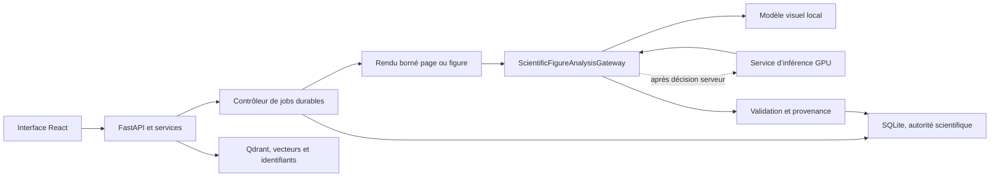

# Préparation de la lecture d’image pour une exécution serveur

## Décision

La migration serveur ne doit pas déplacer tout CiderScholar uniquement pour accélérer la lecture
d’image. La première cible est une architecture hybride :

- React, FastAPI, les services métier, SQLite et Qdrant restent ensemble ;
- un adaptateur d’inférence visuelle peut être local ou appeler un service GPU distant ;
- le service GPU reçoit uniquement un artefact image borné et un contexte strict, jamais un chemin
  local, un accès SQLite ou un accès Qdrant ;
- le résultat revient au service CiderScholar, qui le valide et le persiste.

SQLite reste ainsi l’autorité scientifique et le service d’inférence demeure remplaçable et sans
état métier.

## Terrain préparé localement

`app/ingestion/visual_contracts.py` définit trois frontières distinctes :

- `ContextCaptionGateway` conserve l’enrichissement actuel fondé uniquement sur la légende, les
  cellules et le texte voisin ;
- `ImageCaptionGateway` réserve un contrat de légendage d’image non citable ;
- `ScientificFigureAnalysisGateway` porte l’analyse ciblée par une question, avec scores de
  pertinence et de lisibilité, variables, unités, tendances et limites.

`VisualArtifactDescriptor` identifie un rendu immuable par UUID et SHA-256. Il conserve page, boîte,
format et dimensions, mais aucun chemin de fichier ou identifiant de stockage. Le même contrat peut
donc être utilisé dans le processus local, par HTTP multipart ou par un autre transport.

`ScientificFigureAnalysisRequest.idempotency_key` dépend de l’image, de la question, du contexte, de
la version de prompt et du profil de modèle. Une reprise ou un doublon réseau peut ainsi réutiliser
honnêtement le même résultat.

L’enrichissement ARGO existant passe désormais par `ArgoContextCaptionGateway`. Cette modification ne
rend aucun appel réseau supplémentaire et ne change pas le statut non citable des légendes
synthétiques.

La lecture de figures locale utilise `OllamaScientificFigureAnalysisGateway`. La découverte des
figures, la résolution du PDF, le rendu et la persistance SQLite restent dans le service applicatif ;
la passerelle ne voit que `ScientificFigureAnalysisRequest` et les octets PNG. Une implémentation GPU
distante pourra donc remplacer Ollama sans recevoir de chemin, de connexion SQLite ou de client
Qdrant.

## Ce qui reste local tant qu’aucun serveur n’est décidé

Il ne faut pas encore :

- ouvrir FastAPI sur le réseau ou modifier la valeur sûre `127.0.0.1` ;
- ajouter un stockage objet, Redis, Celery ou une seconde base de données ;
- faire lire SQLite ou Qdrant par un processus distant ;
- ajouter une URL de service GPU ou un secret inutilisé ;
- persister des images rendues sans politique de rétention validée ;
- transformer une description générée en preuve scientifique.

Ces ajouts créeraient dès maintenant des surfaces d’exploitation, de confidentialité et de reprise
sans apporter de gain à l’application locale.

## Artefacts visuels à produire avant l’appel au modèle

Le futur renderer doit produire un crop PNG, JPEG ou WebP à partir du PDF et de la boîte persistée.
Pour chaque artefact, il doit :

1. vérifier que la page et la boîte appartiennent au PDF identifié par son SHA-256 ;
2. borner résolution, dimensions et taille en octets ;
3. calculer le SHA-256 exact des pixels encodés ;
4. créer un `VisualArtifactDescriptor` sans chemin local ;
5. supprimer le fichier temporaire après l’appel ou selon une rétention explicitement configurée.

Le cache doit être indexé par hash de document, hash d’image, version du renderer, version du prompt
et révision du modèle. Il ne doit plus dépendre de l’égalité d’un chemin absolu entre deux machines.

## Contrat du futur service GPU

Le service distant reste une façade d’inférence spécialisée. Il ne possède ni corpus ni logique RAG.
Une requête transporte :

- le JSON strict `ScientificFigureAnalysisRequest` ;
- les octets de l’image dans une partie multipart distincte ;
- une clé d’idempotence ;
- un identifiant de corrélation non scientifique.

La réponse `ScientificFigureAnalysisResponse` contient le hash de l’image, l’identité et la révision
du modèle, la version de prompt, l’observation structurée et des avertissements bornés. Le client
refuse une réponse dont le hash, la version ou le schéma ne correspondent pas à la requête.

Le modèle est chargé paresseusement au premier travail, réutilisé par un nombre borné de workers GPU
et fermé explicitement à l’arrêt. Les délais, nouvelles tentatives, annulations et limites de VRAM
restent contrôlés par le job CiderScholar.

## Confidentialité

Le corpus est commun : l’envoi distant d’un crop peut être activé par configuration administrateur.
Dans tous les cas, il impose TLS, authentification de service, taille bornée, journaux sans pixels ni
texte, chiffrement au repos si une rétention existe, suppression vérifiable et métriques sans contenu.

Envoyer seulement le crop réduit l’exposition. L’envoi du PDF complet ou son dépôt durable sur le
serveur demande une décision d’architecture et de confidentialité séparée.

## Intégrité scientifique

La légende issue du modèle reste un enrichissement de recherche non citable. Si une version future
extrait des valeurs ou des observations depuis une figure, elle doit les persister séparément avec :

- le hash du PDF et de l’image ;
- la page et la boîte source ;
- le modèle, sa révision, le prompt et leurs versions ;
- le statut `candidate`, `validated` ou `rejected` ;
- la décision de validation et sa provenance.

Seul un résultat validé peut devenir une preuve. Qdrant ne reçoit que vecteurs, identifiants et
métadonnées minimales ; les pixels, textes et décisions restent sous l’autorité SQLite.

## Migration complète éventuelle

Une migration ultérieure de toute l’application peut placer FastAPI, le contrôleur de jobs et SQLite
sur le même serveur avec un disque local chiffré et sauvegardé, derrière un reverse proxy avec TLS et
authentification. Les workers GPU restent séparés.

SQLite n’est pas partagé sur un lecteur réseau. Pour conserver la règle actuelle, un unique service de
persistance possède les écritures SQLite. Une mise à l’échelle horizontale nécessitant plusieurs
écrivains demanderait un ADR distinct et une modification explicite des règles d’ingénierie avant
toute adoption de PostgreSQL ou d’une file externe.

## Déclencheurs de la phase serveur

La phase distante ne commence que lorsque ces éléments sont connus :

- machine et GPU cibles, VRAM disponible et système d’exploitation ;
- modèle visuel retenu et licence compatible ;
- emplacement réseau, authentification et politique de données privées ;
- volume d’images, latence cible et durée locale de référence ;
- responsable des sauvegardes, mises à jour et incidents.

Le benchmark compare au minimum rendu, transfert, attente de file, inférence et persistance. La
migration est retenue seulement si le temps de bout en bout et la qualité scientifique progressent,
pas uniquement le temps d’inférence GPU.
